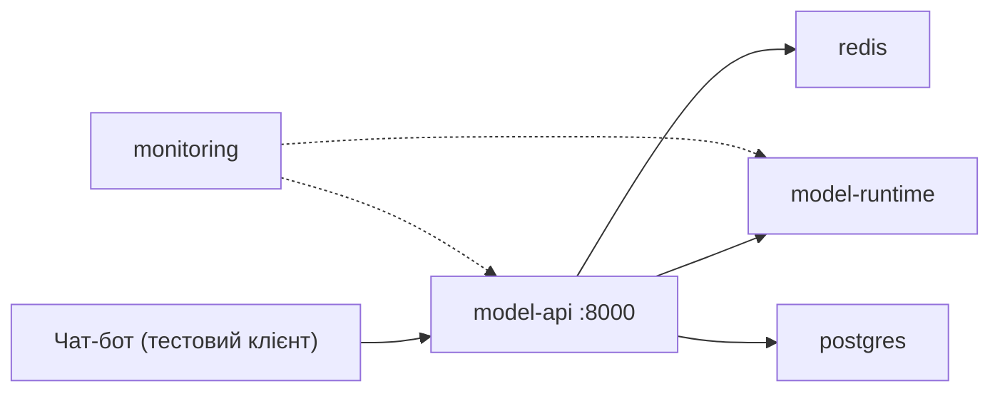

# Compose Readiness Checklist: локальний стенд однією командою

Мета: перевірити, чи можна підняти локальну систему навколо моделі однією командою `docker compose up --build`, без ручних кроків. Це наступний рівень після перевірки окремих образів: окремий образ може працювати, а система з кількох сервісів при цьому не підніматися.

> Стенд Docker Compose не входить у поточну задачу (див. Out of Scope в [`ai_ml_team_task.md`](ai_ml_team_task.md)). Чек-лист підготовлено заздалегідь, щоб наступна задача мала готові критерії. Усі пункти зараз мають статус "Очікує".

## Склад системи

| Сервіс | Роль у сценарії чат-бота | Звідки образ |
|---|---|---|
| `model-api` | HTTP-інтерфейс, який викликає чат-бот: перевірка стану і запит на передбачення | збирається з репозиторію |
| `model-runtime` | виконує інференс; може бути частиною `model-api` або окремим сервісом на базі `ml-infer-slim:1.0` | `ml-infer-slim:1.0` |
| `redis` | черга запитів і кеш результатів для повторних фото | офіційний образ `redis` з фіксованою версією |
| `postgres` | журнал запитів і передбачень для аналізу якості | офіційний образ `postgres` з фіксованою версією |
| `monitoring` | збір базових метрик сервісів (наприклад, Prometheus і Grafana) | офіційні образи з фіксованими версіями |

## Чек-лист

| # | Що перевіряємо | Як перевірити | Що вважається "Так" | Статус |
|---|---|---|---|---|
| 1 | Є `compose.yaml` | файл у корені репозиторію; `docker compose config` без помилок | файл є і проходить перевірку синтаксису | Очікує |
| 2 | Описаний `model-api` | розділ `services` у `compose.yaml` | сервіс збирається з репозиторію (`build`), має порт і змінні оточення | Очікує |
| 3 | Описані всі залежні сервіси | розділ `services` | є `model-runtime` (або він явно вбудований у `model-api`), `redis`, `postgres`, `monitoring`; версії образів зафіксовані, без `latest` | Очікує |
| 4 | Сервіси не потребують ручного запуску | `docker compose up --build`, потім `docker compose ps` | усі сервіси в стані `running` / `healthy`; порядок старту задано через `depends_on` з умовою `service_healthy`, без ручних команд усередині контейнерів | Очікує |
| 5 | Правильно налаштований порт | `docker compose ps`, `compose.yaml` | назовні відкрито лише `model-api` (наприклад, `8000:8000`) і за потреби інтерфейс моніторингу; `redis` і `postgres` назовні не відкриті або прив'язані до `127.0.0.1`; порти не конфліктують із типовими локальними | Очікує |
| 6 | Є health endpoint | `curl -f http://localhost:8000/health` | відповідь 200, сервіс повідомляє, що модель завантажена | Очікує |
| 7 | Є predict endpoint | `curl -F "file=@tests/images/lamp.jpg" http://localhost:8000/predict` | відповідь з top-3 класами і ймовірностями, той самий результат, що й `docker run` образу slim на цьому зображенні | Очікує |
| 8 | Конфігурації винесені в `.env` | `compose.yaml` посилається на змінні; у репозиторії є `.env.example` | адреси, порти, імена БД задаються змінними; `.env` у `.gitignore`, у репозиторії лише `.env.example` | Очікує |
| 9 | Немає production-секретів | перегляд `compose.yaml`, `.env.example`, історії комітів | лише локальні тестові значення (`postgres` / `local_password`), жодних реальних паролів, токенів, ключів хмари | Очікує |
| 10 | Локальний стенд не підключений до production DB, Redis або queue | значення хостів у `.env.example` і `compose.yaml` | хости це імена сервісів Compose (`postgres`, `redis`), а не адреси робочих серверів; доступ до робочої мережі не потрібен | Очікує |
| 11 | Команда `docker compose up --build` описана в README | читання `README.md` | є команда запуску, зупинки (`docker compose down`), приклад перевірки health і predict | Очікує |
| 12 | Дані не губляться між перезапусками | `docker compose down`, потім `up`, перевірити журнал у `postgres` | для `postgres` налаштовано volume | Очікує |

## Фінальний висновок

Локальний стенд можна вважати готовим, якщо всі сервіси піднімаються однією командою, а test prediction виконується без ручних дій.

Поточний стан: стенд не готовий, бо ще не створений; це очікувано, він запланований наступною задачею. Найважливіші пункти для AI PM: 4 (одна команда без ручних кроків), 7 (predict дає той самий результат, що й образ) і 9-10 (стенд ізольований від робочих даних). Порушення 9 або 10 це стоп-фактор незалежно від решти.
